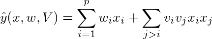
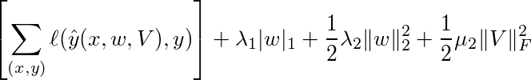

# Factorization Machine (FM)

For a *p* dimension example *x*, FM models the data by



where *w_i* denotes by the i-th element of the *p*-length vector *w*, and *v_i*
denotes by the i-th row of the *p*-by-*k* matrix *V*.

Given training data pairs *(x,y)*, FM learns the model
*w* and *V* by solving the following objective:

<!-- \left[\sum_{(x,y)} \ell(\hat y(x,w,V), y)\right] + \lambda_1 |w|_1 + \frac{1}{2} \lambda_2
\|w\|_2^2 + \frac{1}{2} \mu_2 \|V\|_F^2 -->



Here *ℓ* is the loss function such as logistic loss. If we set *k=0*, then
FM is a linear method. Therefore, the configuration to run FM is almost identical to [linear method](../linear/guide).

### How to choose *k*

The right choice of the embedding dimension *k* varies for different data, and
even for different features in the same dataset. A large *k* increases the model
complexity and therefore potentially gives better accuracy. While a smaller *k*
can reduce the overfitting, memory consumption, and network traffic.

We can specify *k* using the following rules:

```
if feature i appears more than 1024 times
    then use a 512 embedding size
else if feature i appears more than 256 times
    then use a 64 embedding
else
    no embedding
```

The according configuration is

```proto
embedding {
dim = 512
threshold = 1024
}
embedding {
dim = 64
threshold = 256
}
```

### Learning algorithm

In default, the objective function is minimized by distributed asynchronous
stochastic gradient descent.

## Build and Run

First run `../../make/build_deps.sh` if you didn't run it before. Then
`make`. (Only tested on linux with gcc >= 4.8).

Train a small dataset in local machine by 1 worker and 1 server:

```
cd guide
../../../dmlc-core/tracker/dmlc_local.py -n 1 -s 1 ../build/fm.dmlc demo.conf
```

More documents:

- [Use bigger datasets](../guide/data.md)
- [Launch jobs in multiple machines](../guide/run.md)
