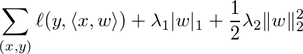

# Linear Method

Given data pairs *(x,y)*, the linear method learn the model vector *w* by minizing the
following objective function



where *ℓ* is the loss function such as logistic loss and hinge loss.


## Build and Run

First to go the root directory of `wormhole`, then build by `make linear`. Now
train a small dataset in local machine by 1 worker and 1 server:

```
tracker/dmlc_local.py -n 1 -s 1 bin/linear.dmlc learn/linear/guide/demo.conf
```

More documents:

- [Use bigger datasets](../../docs/data.md)
- [Launch jobs in multiple machines](../../docs/run.md)
