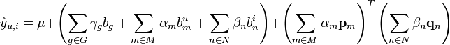

# SVDFeature Method

The feature-based matrix factorization models the prediction score as below:



μ is the base score of the predictions. G,M,N are the indice sets of global features, user features, item features respectively, and γg,αm,βn are the feature values extracted according to the design of the features. Here γ, α, β are global feature, user feature and item feature respectively. The global features try to incorporate the information which are related to both users and items and the feature weight is shared in the whole rating sets, and the user features and item features try to incorporate the information only related to users or items. For instance, we can encode global bias as global feature, user backgrounds as user feature and item attributes as item features.

## Input Format

The input format is in sparse feature format similar to SVM format, but we use namespace to specify three kinds of feature. The format is as follows: 

line:= target |g g1:v1 ... gk:vk  |u u1:v1 ... u2:v2 |i i1:v1 ... i2:v2

|g indicates the followings are global features

|u indicates the followings are user features

|i indicates the followings are item features

For example,if we use basic matrix factorization model, the sample of user 0 and item 10 with rate 5 is as follows
```
5 |u 0:1 |i 10:1
```

## Quick start

Go the root directory of `wormhole`, then build by `make svdfeature`. Next try
a small dataset using 2 worker and 1 server:

```
tracker/dmlc_local.py -n 2 -s 1 bin/svdfeature.dmlc learn/svdfeature/guide/demo.conf
```

